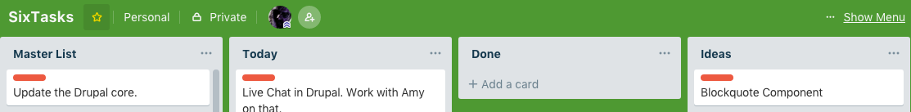

## Welcome to SixTasks, a productivity method that helps you to prioritize tasks and to get them done, six tasks at a time.
#### This is the short version of the SixTasks Method and shows you how to get it working for yourself as quickly as possible.
The premise of this method is to commit yourself to get six of the most important and impactful tasks every day.

> Plan your work for today and every day, then work your plan. 
> <cite>**Margaret Thatcher**</cite>

**Here is what you need, and how it works!**
* **Lists** – You start by creating three task lists in your favorite To-Do app or if you prefer a notepad will work just fine. I named my lists “Master List,” “Ideas” and “Today”. App Options: A few to-do apps that work fantastically with the SixTask method, Todoist, iPhone's Reminder app, Microsofts Todo and my favorite Trello.

* **Add tasks** – First, fill your “Master List” with everything you need to get done. You don't need to create an all-inclusive list or sort it. You always can add new items as they come up. My first list ended up with about 15 (important) tasks.
* **Pick six tasks** – Next, read through all your tasks without taking action just yet. Then read through your list once again and pick six of the most important tasks you need to do and move them into the “Today” list. I recommend you do this step the evening before you start with this system.
* **Working your tasks** – Pick a task from your "Today" list and work on it until done or until you feel you need to stop on that task for today. If you complete the task, awesome, check it off. If you did not complete the task move it back into your “Master List”. Repeat that for all tasks left in your “Today” list.
* **Continue on** – When you reached the end of your “Today” list – fantastic, but what now? Just move on and continue with any other task in your “Master List,” or as I often do, move on to fun stuff for the day. Sometimes you will get the six tasks you picked out of the way before noon, but there will be days it seems impossible.
* **Review** – Every evening take a few minutes and review what you accomplished that day. This is also the time when you will pick and commit yourself to the next six most important and impactful tasks for the next day by moving them into the “Today” list. It is important to pick only six tasks for your next day's challenge. Anything more and you risk failing and ultimately end up discouraged and believing the system did not work for you.
* **Ideas** – We always think of our best ideas during meetings, while on a walk, or in the shower, but never while pondering over our task list. However, we don't want to forget about the [great] ideas we have and need to make it a habit to add ideas to your “Ideas” list whenever you think of them. Note: Ideas are just that, ideas or plans that are not ready for action, but at least you will have them noted down for future action. Make it a habit to review the  “Ideas” list every now and then to see if older ideas have turned actionable or obsolete.
* **Cleaning up** – Everyone, myself included, creates tasks that never get done and that linger on in our “Master List” for way too long. Deal with these items! Either, get them done, mark them with a due date, or move them into your “Ideas” list, but more often than not we can just delete them.
Recap

That's it, let me know when and if you try the SixTasks approach and how it works[ed] for you. I would love to hear about any suggestions and improvements to the system. Send all feedback to six-tasks@outlook.com

<strong>Footnote:</strong> There is nothing new in the SixTask method of doing things. It simply is methods taken from other works and rearranged to make it work for myself.   
The SixTask methodology leans [very] heavily on Mark Forsters, excellent <a href="http://markforster.squarespace.com/autofocus-system">Autofocus System</a> and the Ivy Lee methotology as explained so eloquently by <a href="https://colterreed.com/the-ivy-lee-method-simply-productive/">Colder Reed</a>. Yet other parts are borrowed from works by Heidi Grant Halvorson, especially from her book <a href="https://amzn.to/2G4Uw4L">"9 things successful people do differently"</a>, certainly a must read for anyone.

